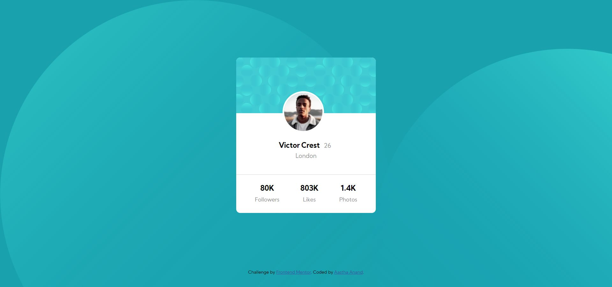

# Frontend Mentor - Profile card component solution

This is a solution to the [Profile card component challenge on Frontend Mentor](https://www.frontendmentor.io/challenges/profile-card-component-cfArpWshJ). Frontend Mentor challenges help you improve your coding skills by building realistic projects.

## Table of contents

- [Overview](#overview)

  - [The challenge](#the-challenge)
  - [Links](#links) -[Screenshot](#Screenshot)

- [My process](#my-process)
  - [Built with](#built-with)
  - [What I learned](#what-i-learned)
  - [Continued development](#continued-development)
  - [Author](#author)

## Overview

### The challenge

- Build out the project to the designs provided

### Links

- Solution URL: [Project-3](https://github.com/aasthaanand123/Project-3)
- Live Site URL: [Netlify](https://profilecard1.netlify.app/)

### Screenshot

## My process

### Built with

- HTML5
- CSS properties
- Flexbox
- Mobile-first workflow

### What I learned

I revised concepts of flexbox and other css properties.

### Continued development

I am not really comfortable with using svg images so I will try to incorporate that in my practice so that I am able to work with them.

## Author

- Frontend Mentor - [aasthaanand123](https://www.frontendmentor.io/profile/aasthaanand123)
- Twitter - [@Aastha92424004](https://www.twitter.com/@Aastha92424004)
